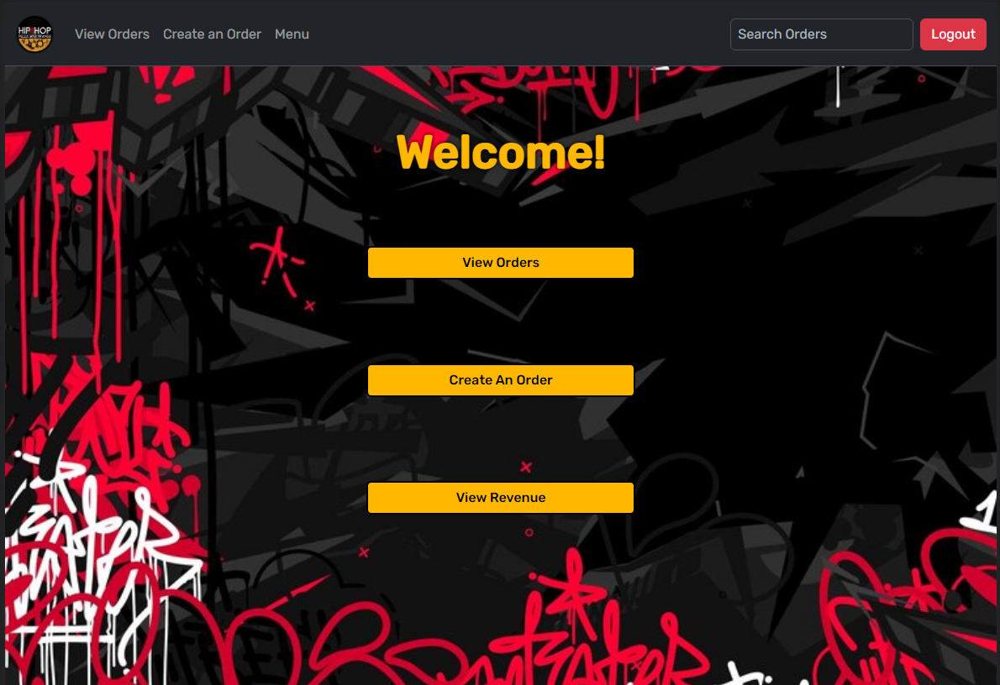
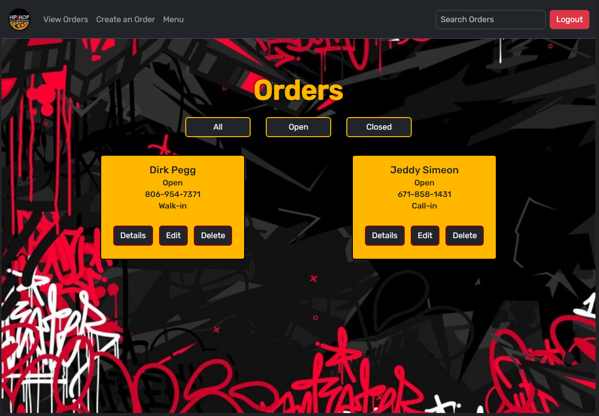
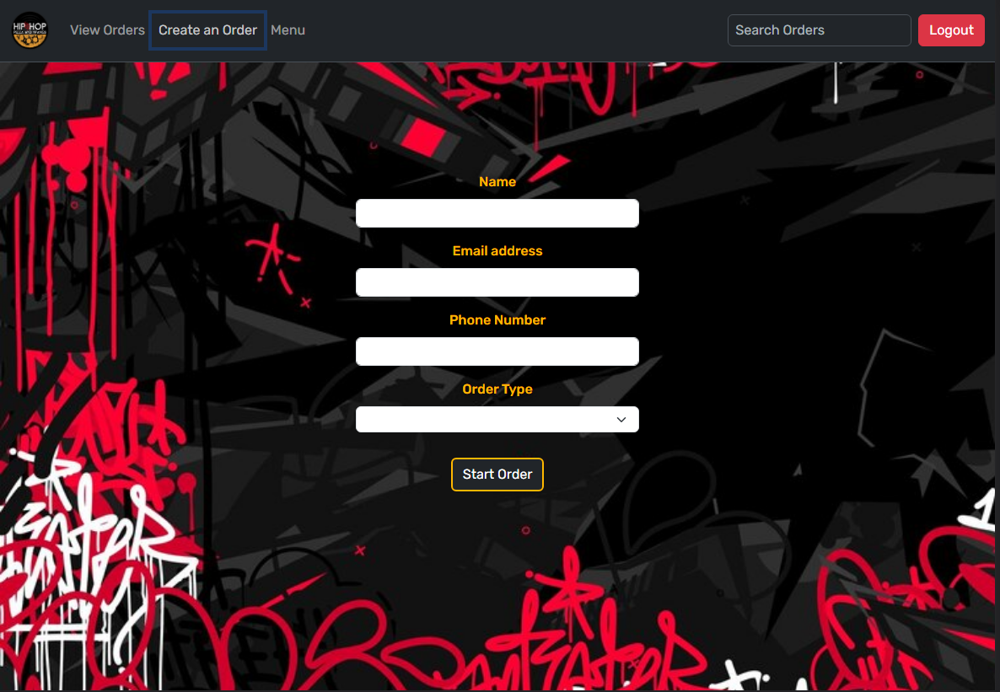
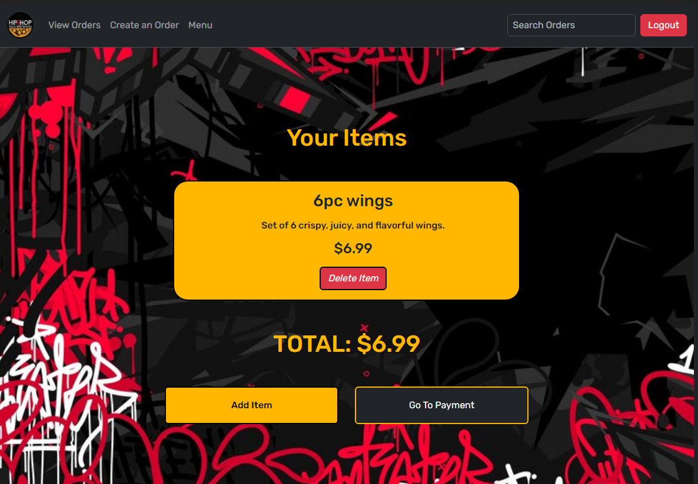
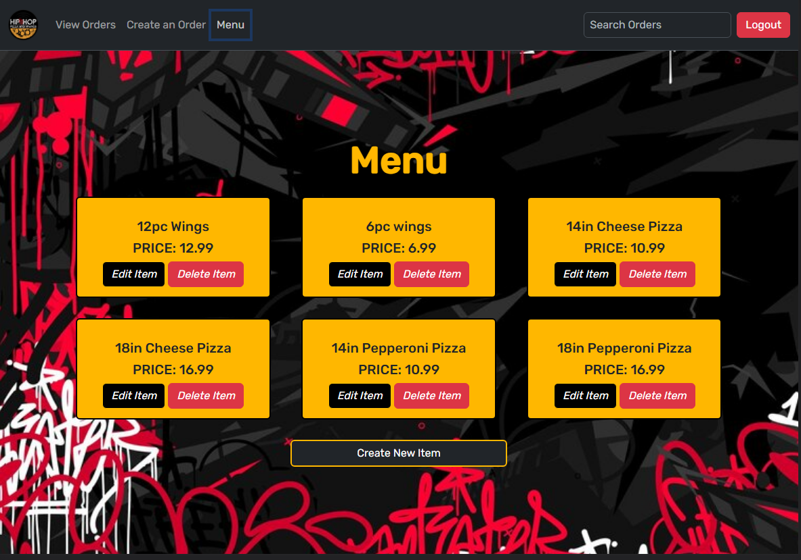
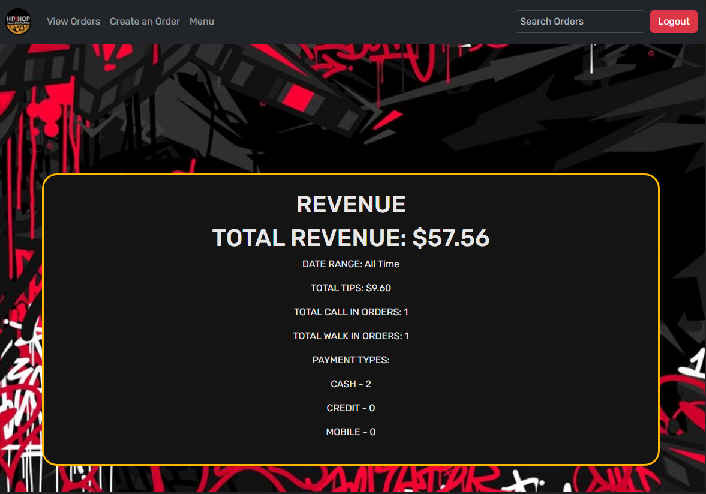

#HipHop Pizza & Wangz POS system
This is a POS (point of sale) system that allows a user to easily create, read, update, and delete orders while storing information such as: 
- order items
- order price
- revenue from all orders

#Motivation
We wanted to create an app that was user friendly that allowed the creation and manipulation of data that could be utilized in a fast paced food service environment. 
High stress and volume is common in food service, so a clean and concise UI was our intention with this app. A clear way to navigate to any order or page is necessary to maintain efficiency in an environment like that.

#Screenshots

#Tech used
- Vanilla JS
- HTML
- SCSS
- Bootstrap 
- Firebase

#Features
This has many features to allow quick navigation: 
- A Navbar with all necessary links
- a search bar that allows the user to search orders by phone number or name
- filter buttons to allow the user to filter orders by status (open/closed)
- tip suggestion buttons that help the user do the math for proper tipping

#References/Planning
[userflowchart] https://excalidraw.com/#json=KTT1VGD44NtZqrDnL-j57,0gxoobSKsEuFjnj1pV17wg
[ERD] https://dbdiagram.io/d/64fd20b502bd1c4a5e45a748
[creationFlowchart](image-7.png)

#Deployment
